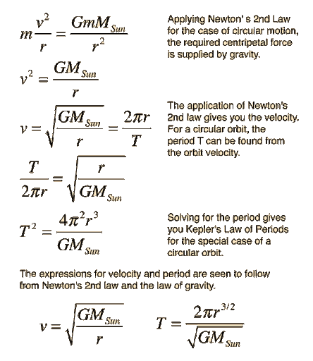

# Circular Motion

## Basics

$\text{Angular Momentum} = L = mvr = m\omega r^2 \\
\text{Centripetal Force} = \frac{mv^2}{r}= m\omega^2 r$ 

## Perpendicular Axis Theorem

## Parallel Axis Theorem
$I_f = I_i+mr^2$ 

## Common Moment of Inertias

# Simple Harmonic Motion

$d = a \sin(\omega t) \\$
$f = \frac{1}{T}\\$
$f = \frac{\omega}{2\pi} \\$

### GENERAL SHM
If displacement $x$ causes acceleration $a$, then the period of oscillations is 

$T = 2 \pi \sqrt{\frac{x}{a}}$

($a = - \omega^2 x$)

### Spring
$T = 2\pi \sqrt{\frac{m}{k}} \\$
$\omega = \sqrt{\frac{k}{m}}$

### Simple Pendulum
$T = 2\pi \sqrt{\frac{l}{g}} \\$
$\omega = \sqrt{\frac{g}{l}}$

### Physical Pendulum 
{ height=256px }

# Error Propagation
$\Delta (Cx) = C\Delta x$ \
$\Delta (x + y) = \Delta (x - y) = \sqrt{(\Delta x)^2 + (\Delta y)^2}$ \
$\Delta (x y) = xy * \sqrt{(\frac{\Delta x}{x})^2 + (\frac{\Delta y}{y})^2}$

$\Delta (k = \frac{x y}{z}) = k \sqrt{(\frac{\Delta x}{x})^2 + (\frac{\Delta y}{y})^2}$

$\Delta (x y z) = xyz * \sqrt{(\frac{\Delta x}{x})^2 + (\frac{\Delta y}{y})^2 + (\frac{\Delta z}{z})^2 ...}$ \

$\Delta (x^m y^n) = x^m y^n * \sqrt{(\frac{m \Delta x}{x})^2 + (\frac{n \Delta y}{y})^2 ...}$ \

$\Delta (\frac{4x + y}{5}) = \frac{\sqrt{(4 \Delta x)^2 + (\Delta y)^2}}{5}$ \

# Collisions

### Perfectly Elastic Collisions

* $v_2' = \frac{2m_1}{m_1+m_2}v_1 - \frac{m_1-m_2}{m_1+m_2}v_2$\
* $v_1' = \frac{m_1-m_2}{m_1+m_2}v_1 + \frac{2m_1}{m_1+m_2}v_2$\

### Perfectly Elastic Collisions (still object)

* $v_2' = \frac{2m_1}{m_1+m_2}v_1$\
* $v_1' = \frac{m_1-m_2}{m_1+m_2}v_1$\

# Gravity/ Orbit
{ height=256px }\
{ height=500px }

# Energy
$\text{Power} = P = \frac{W}{\Delta t} = Fv$\
$\text{Impulse} = I = F \Delta t = m \Delta v$

# Kinematics

1. $v = v_0 + at$
2. $\Delta x = \frac{(v+v_0)}{2}t$
3. $\Delta x = v_0t + \frac{1}{2}at^2$
4. $v = v_0 + at$
5. $v^2 = v_0^2 + 2a\Delta x$

### Launching Ball from Ground
$\text{Range} = \frac{2v^2 \sin{\theta} \cos{\theta}}{g} =\frac{v^2 \sin{(2 \theta)}}{g}$

### Launching ball from cliff

#### Optimal angle  
$h = \frac{v^2}g \left( \frac1{2\sin^2\theta} - 1\right) \\$
$\Rightarrow \sin\theta = \left( 2 \left(\frac{gh}{v^2} + 1\right) \right)^{-1/2}$